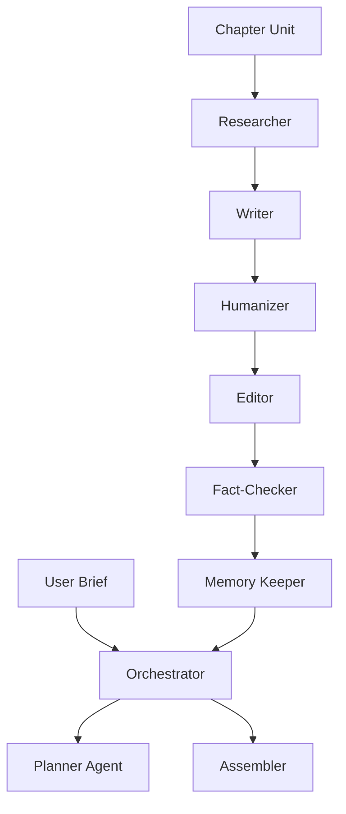

# AIuthor Architecture Specification

## 1. Orchestration Topology
Orchestrator-Worker pattern.

## 2. Model Routing Strategy
All components now use Gemini via `google.genai` SDK.
- Generation: `gemini-2.0-flash`
- Embeddings: `text-embedding-004`

## 3. Self-Healing
Repair logic for chapter insertion handles TOC and Glossary regeneration.
