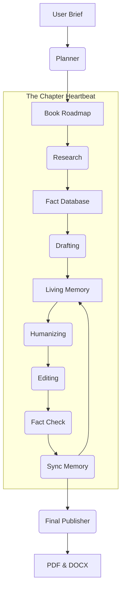

# AIuthor: The Human-First Agentic Publisher

Welcome to the internal workings of AIuthor. We didn’t build this to be just another "content generator." We built it to be a digital publishing house that thinks, researches, and writes with the same care a human editor would.

This document serves as your complete guide to our architecture, our prompts, and why we made the choices we did.

---

## 1. How the System Thinks (Architecture)

Most AI systems try to do everything at once. AIuthor doesn't. We use a **Sequential Worker Chain**—a pipeline where each agent has one job and does it well. 

### The Workflow
It starts with a **Planner** who maps out the book. Then, for every single chapter, the **Researcher** digs for facts, the **Writer** drafts the prose, the **Humanizer** strips away the "AI-voice," and the **Editor** polishes the flow. Finally, the **Fact-Checker** ensures we haven't hallucinated, and the **Memory Keeper** makes sure the system remembers what happened on Page 1 when it's writing Page 100.

### Why This Matters
By giving each chapter its own "heartbeat" of research and editing, we ensure the book stays grounded. The **MemoryState** act as our blackboard, keeping track of character names, facts, and callbacks so the book feels like a single, cohesive narrative.

---

## 2. The Prompts Dossier (Our Secret Sauce)

We believe a prompt should be a role, not a request. Here is the logic we’ve baked into our agents.

### The Humanizer (The Soul of the System)
This is where we kill the generic AI voice. Our rules are strict: 
- No "delving into" or "landscapes."
- No "it's important to note."
- Vary the rhythm—mix short, punchy sentences with longer, flowy ones.
- Use metaphors drawn from the book's specific domain.

### The Fact-Checker (The Guardian)
Accuracy isn't optional. If our Researcher didn't find a fact in the RAG database, the Fact-Checker forced the Writer to "soften" the claim. Instead of saying "This happened in 1920," the system will say "Historians often suggest..." unless the date is verified.

### The Memory Keeper (The Librarian)
After every chapter, this agent identifies "callbacks"—specific phrases or events that should be mentioned again later. This is how we ensure the book feels "written," not just "generated."

---

## 3. Why We Built It This Way (Design Decisions)

1.  **Sequential over Parallel**: We chose a sequential pipeline because a book is a linear experience. Agents need to know what happened in the previous chapter to write the next one effectively.
2.  **Pydantic for Stability**: We use strong data typing. If an agent tries to return garbage JSON, the system catches it immediately.
3.  **Local Memory over Context Stuffing**: We don't just jam everything into one prompt. We use a RAG system and a callback index to keep the context clean and focused.
4.  **Self-Healing**: If you insert a chapter in the middle, the system re-runs its repair logic to fix the Table of Contents and Glossary automatically.
5.  **Gemini 1.5 Flash**: We chose This model for its speed and massive context window, perfect for cross-referencing entire book drafts during the editing phase.

---

*AIuthor is more than a tool; it's a partner in the craft of writing. We've automated the heavy lifting so you can focus on the ideas.*
